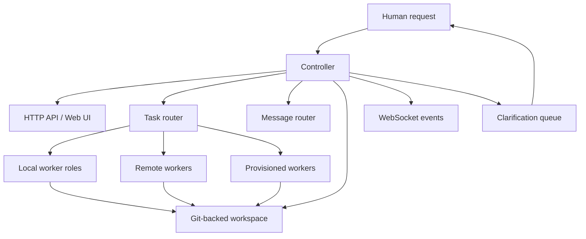
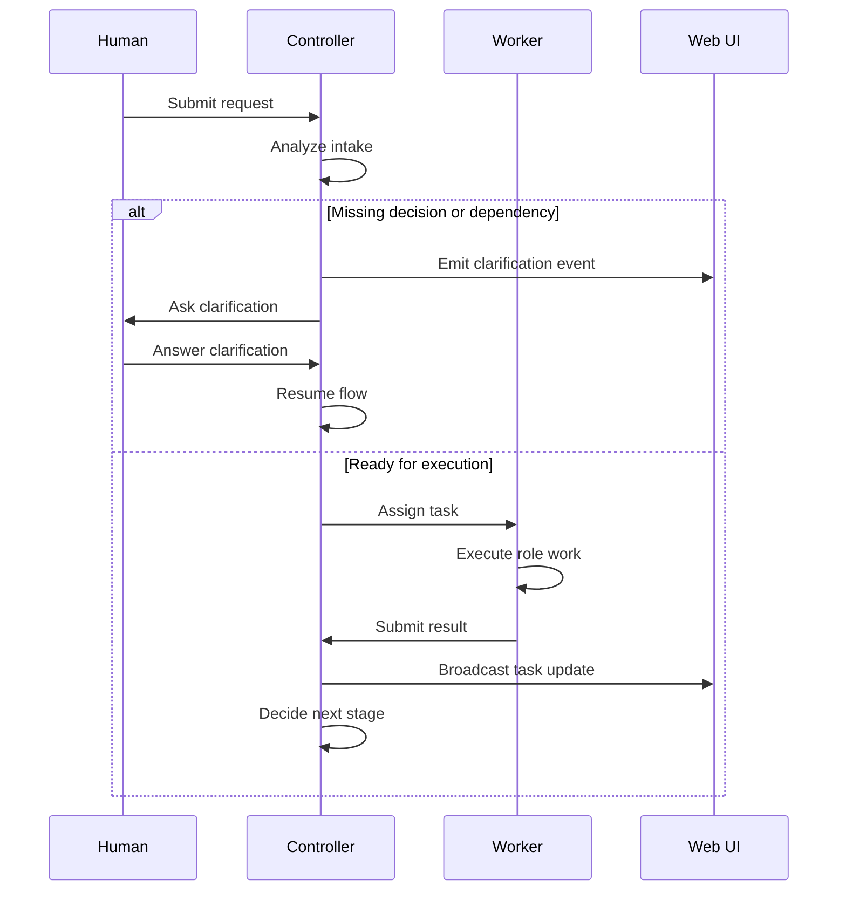
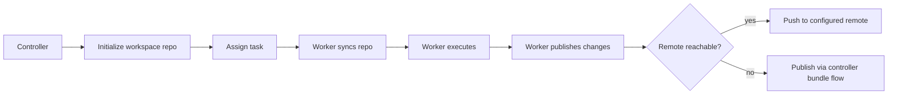

# TeamClaw Design Notes

This document is the **English-first architecture reference** for TeamClaw.

TeamClaw is an OpenClaw plugin that lets a controller coordinate multiple software-delivery roles across a shared workflow. It supports both single-instance local execution (`controller + localRoles`) and controller/worker topologies with on-demand worker provisioning.

## 1. Design goals

TeamClaw is designed to optimize for:

- **visible orchestration** instead of opaque prompt chaining
- **execution-ready task flow** instead of speculative backlog generation
- **role-specific work separation** with controlled handoff
- **clarification-first safety** when requirements or infrastructure are missing
- **Git-backed collaboration** instead of hidden file mutation
- **incremental topology growth** from single-instance to provisioned workers

## 2. High-level architecture



### Core runtime pieces

| Component | Responsibility |
| --- | --- |
| Controller | Intake, clarification management, task creation, routing, worker tracking, Web UI events |
| Worker | Executes role-specific tasks and reports results back to the controller |
| Local worker | Controller-managed child process that behaves like a worker while sharing the same TeamClaw workspace |
| Git workspace | Shared collaboration layer for artifacts, diffs, sync, and publish flows |
| Web UI | Team overview, tasks, clarifications, messages, workspace visibility |

## 3. Task and clarification lifecycle



Important behavior:

- The controller should create **only work that can start now**.
- If a role cannot continue safely, the correct action is to request clarification, not to guess.
- Infra and DevOps work follows the same rule: no pretending infrastructure already exists.
- After a controller-created task completes, the controller can continue the same intake flow and create the next stage if the prerequisites now exist.

## 4. Topology model

| Topology | Description | Typical first use | Validation status |
| --- | --- | --- | --- |
| `controller + localRoles` | Controller launches local worker child processes inside one OpenClaw environment | First setup, lowest debugging surface | Validated |
| distributed workers | Separately launched workers register back to a shared controller | Multi-machine separation | Validated |
| `process` provisioning | Controller spawns local worker processes on demand | First dynamic provisioning step | Validated |
| `docker` provisioning | Controller launches worker containers on demand | Isolated runtime image and host portability | Validated |
| `kubernetes` provisioning | Controller launches worker pods with `kubectl` | Cluster-native environments | Implemented, not benchmark-validated on `ssh13` |

### Why `localRoles` is the default recommendation

It preserves the TeamClaw routing model while minimizing early operational complexity:

- no multi-node networking
- no image distribution
- no controller URL reachability debugging
- no cluster permissions or pod scheduling concerns
- full access to the Web UI, clarifications, workspace, and Git-backed collaboration from day one

## 5. Workspace and Git collaboration

TeamClaw uses Git as the default file collaboration mechanism.

### Collaboration modes

- **Single instance / localRoles**: the controller initializes a Git repository inside the shared workspace.
- **Distributed without external Git**: remote workers sync from controller-provided bundle endpoints.
- **Distributed with explicit remote**: if `gitRemoteUrl` is configured and reachable, workers can `clone / pull / push` against the real remote repository.



## 6. Provisioning model

Provisioning exists for cases where not every role should stay warm all the time.

### `process`

- fastest dynamic topology to debug
- same host, isolated worker processes
- lowest operational overhead of the dynamic providers

### `docker`

- containerized worker isolation
- published TeamClaw runtime image available
- supports persistent workspace roots and bind mounts

### `kubernetes`

- cluster-native worker pods
- requires `kubectl` in the controller runtime
- requires controller-side RBAC to create and delete pods
- requires a controller URL that is truly reachable from inside the pod network

## 7. Web UI and API surface

The controller owns the TeamClaw Web UI and HTTP API.

User-visible capabilities include:

- worker inventory
- task list and task details
- clarification queue
- message log
- workspace visibility
- health and team-state APIs

The Web UI stays useful only if execution remains isolated enough that active worker tasks do not starve the controller process. That is one reason `localRoles` runs workers as child processes rather than running all role work in the controller thread itself.

## 8. Release and validation posture

Current repository and release state includes:

- GitHub Releases
- npm publication workflow
- ClawHub package publication
- a TeamClaw setup skill on ClawHub
- a GitHub Pages site at <https://topcheer.github.io/teamclaw/>

The repository has also been validated on the feasible benchmark topologies for the `ssh13` environment: single instance, distributed, process, and docker.

## 9. Contributor notes

For code-level details, inspect the source tree under `src/`.

Useful repository-level smoke checks:

```bash
node tests/test-worker-contracts.mjs
node tests/test-controller-intake.mjs
```

For broader integration checks, use the existing Docker test harness in `tests/run-tests.sh`.
