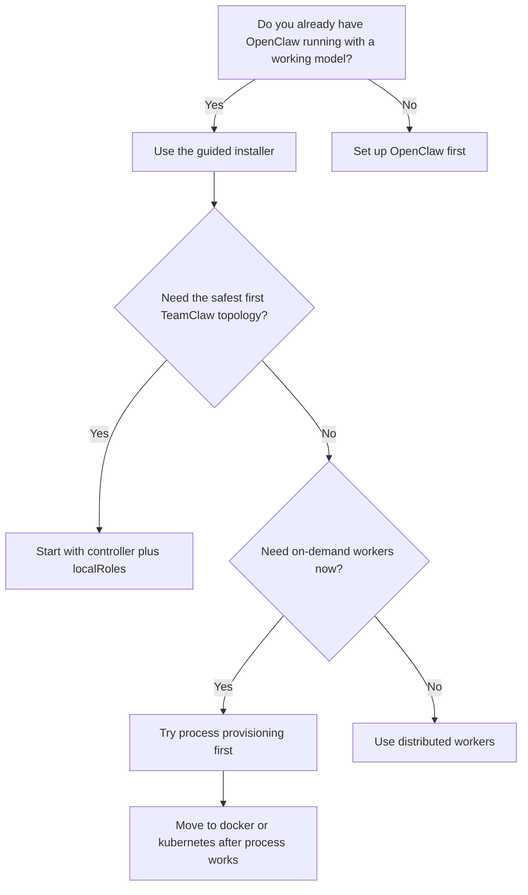

# TeamClaw Installation Guide

This guide is for **first-time TeamClaw users** who want to get to a real working flow quickly.

If you want source layout, repository contributor setup, or implementation details, see:

- [`README.md`](./README.md)
- [`DESIGN.md`](./DESIGN.md)
- Public site: <https://topcheer.github.io/teamclaw/>

## Validation status

TeamClaw is currently **validated end-to-end** on:

- single instance + `localRoles`
- distributed workers
- `process` provisioning
- `docker` provisioning

`kubernetes` provisioning is implemented and documented, but it was **not benchmark-validated** in the `ssh13` environment because `kubectl` was unavailable there.

## Choose the right starting path



## Install options

### Option 1: Guided installer (recommended)

If your local OpenClaw already has at least one working model configuration, the easiest path is:

```bash
npx -y @teamclaws/teamclaw install
```

The guided installer can:

- install or update the TeamClaw plugin
- detect your local `openclaw.json`
- let you choose the install mode
- let you pick from models already defined in OpenClaw
- let you choose the OpenClaw workspace directory
- prefill Docker and Kubernetes defaults with the published TeamClaw runtime image
- prefill Docker workspace persistence with a named volume and Kubernetes persistence with a PVC name

### Option 2: Install from npm

```bash
openclaw plugins install @teamclaws/teamclaw
```

### Option 3: Install from ClawHub

```bash
openclaw plugins install clawhub:@teamclaws/teamclaw
```

## Recommended first setup: controller + localRoles

For most first-time users, this is the least painful path:

1. Run one controller.
2. Register a small set of local roles (`architect`, `developer`, `qa`).
3. Validate a short smoke-test workflow.
4. Expand to distributed or on-demand workers only after the basics are stable.

Why this works well:

- no multi-machine networking to debug
- no `controllerUrl` reachability issues
- no image distribution or cluster setup yet
- Web UI, clarifications, workspace, and Git collaboration all work on one machine first

### Minimal controller config

Add a TeamClaw plugin entry similar to this in `openclaw.json`:

```json
{
  "plugins": {
    "enabled": true,
    "entries": {
      "teamclaw": {
        "enabled": true,
        "config": {
          "mode": "controller",
          "port": 9527,
          "teamName": "my-team",
          "taskTimeoutMs": 1800000,
          "gitEnabled": true,
          "gitDefaultBranch": "main",
          "gitAuthorName": "TeamClaw",
          "gitAuthorEmail": "teamclaw@local",
          "localRoles": ["architect", "developer", "qa"]
        }
      }
    }
  }
}
```

You also need a working OpenClaw model configuration. A common minimum is:

```json
{
  "agents": {
    "defaults": {
      "model": "my-provider/YOUR_MODEL_ID",
      "timeoutSeconds": 2400,
      "workspace": "/absolute/path/to/teamclaw/workspace"
    }
  }
}
```

### Start OpenClaw

```bash
pnpm openclaw gateway run
```

### Validate that TeamClaw is alive

Health check:

```bash
curl http://127.0.0.1:9527/api/v1/health
```

Web UI:

```text
http://127.0.0.1:9527/ui
```

For the first run, you should see:

- workers listed for `architect`, `developer`, and `qa`
- the `Tasks`, `Clarifications`, `Workspace`, and `Messages` tabs
- a healthy controller response from `/api/v1/health`

### First smoke-test suggestion

Start with a short requirement such as:

```text
Create a minimal static website in the workspace with a README, index.html, and style.css.
```

Confirm the following before you scale up:

- the controller creates tasks
- local workers pick up tasks automatically
- files appear in the workspace
- the Web UI shows task details and messages

## Timeout tuning matters

One of the most common first-install mistakes is assuming TeamClaw is broken when the inner OpenClaw agent timed out first.

Watch both timeouts together:

- TeamClaw: `taskTimeoutMs`
- OpenClaw: `agents.defaults.timeoutSeconds`

A safe first setup is:

- `taskTimeoutMs = 1800000` (30 minutes)
- `agents.defaults.timeoutSeconds = 2400` (40 minutes)

Rule of thumb: **OpenClaw's timeout should not be smaller than TeamClaw's timeout**.

Local `localRoles` and `process` workers now place their runtime directories next to the parent of `agents.defaults.workspace`, inside `teamclaw-runtimes/`, rather than hard-coding `/tmp`.

## Distributed workers

Use this after the single-instance path is already stable.

### Controller-side core config

```json
{
  "mode": "controller",
  "port": 9527,
  "teamName": "my-team",
  "taskTimeoutMs": 1800000,
  "gitEnabled": true,
  "gitDefaultBranch": "main"
}
```

### Worker-side core config

```json
{
  "mode": "worker",
  "port": 9528,
  "role": "developer",
  "taskTimeoutMs": 1800000,
  "gitEnabled": true,
  "gitDefaultBranch": "main",
  "controllerUrl": "http://YOUR_CONTROLLER_HOST:9527"
}
```

First-time distributed advice:

- start with only one `developer` worker
- hard-code `controllerUrl` before relying on mDNS discovery
- verify worker registration before adding more roles

## On-demand worker provisioning

On-demand provisioning is powerful, but it is **not** the best first install path.

Supported providers:

- `process`
- `docker`
- `kubernetes`

### Recommended first provisioning step: `process`

```json
{
  "mode": "controller",
  "port": 9527,
  "teamName": "my-team",
  "workerProvisioningType": "process",
  "workerProvisioningRoles": [],
  "workerProvisioningMinPerRole": 0,
  "workerProvisioningMaxPerRole": 2,
  "workerProvisioningIdleTtlMs": 120000,
  "workerProvisioningStartupTimeoutMs": 120000
}
```

`workerProvisioningRoles: []` means the controller can decide at runtime which TeamClaw roles to warm or launch by default. Even if you specify a preferred subset, TeamClaw can still launch another role if a pending task explicitly requires it.

If `process` is not healthy yet, `docker` and `kubernetes` will only be harder to debug.

### Before you attempt Docker or Kubernetes, answer these questions

1. How will new workers reach the controller?
2. How will workers receive runtime dependencies and credentials?
3. How will workers gain access to Docker, `kubectl`, or other infrastructure tooling?
4. Is `workerProvisioningControllerUrl` actually reachable from inside the container or pod network?

### Docker example

```json
{
  "mode": "controller",
  "port": 9527,
  "teamName": "my-team",
  "workerProvisioningType": "docker",
  "workerProvisioningControllerUrl": "http://host.docker.internal:9527",
  "workerProvisioningImage": "ghcr.io/topcheer/teamclaw-openclaw:latest",
  "workerProvisioningWorkspaceRoot": "/workspace-root",
  "workerProvisioningDockerWorkspaceVolume": "teamclaw-workspaces",
  "workerProvisioningRoles": ["developer", "qa", "infra-engineer"],
  "workerProvisioningMaxPerRole": 3,
  "workerProvisioningDockerMounts": [
    "/var/run/docker.sock:/var/run/docker.sock"
  ],
  "workerProvisioningPassEnv": ["DOCKER_HOST", "DOCKER_CONFIG", "KUBECONFIG", "NO_PROXY"]
}
```

### Kubernetes example

```json
{
  "mode": "controller",
  "port": 9527,
  "teamName": "my-team",
  "workerProvisioningType": "kubernetes",
  "workerProvisioningControllerUrl": "http://teamclaw-controller.default.svc.cluster.local:9527",
  "workerProvisioningImage": "ghcr.io/topcheer/teamclaw-openclaw:latest",
  "workerProvisioningWorkspaceRoot": "/workspace-root",
  "workerProvisioningKubernetesWorkspacePersistentVolumeClaim": "teamclaw-workspace",
  "workerProvisioningRoles": ["developer", "qa"],
  "workerProvisioningKubernetesNamespace": "default",
  "workerProvisioningKubernetesServiceAccount": "teamclaw-worker",
  "workerProvisioningPassEnv": ["HTTP_PROXY", "HTTPS_PROXY", "NO_PROXY"]
}
```

## Kubernetes and Helm notes

If you want to run the controller in Kubernetes, the repository ships a Helm chart:

- `deploy/helm/teamclaw`

The chart manages:

- controller `Deployment`
- `Service`
- `openclaw.json` `Secret`
- `ServiceAccount` and RBAC
- workspace PVC
- optional `Ingress`

### Important Kubernetes notes

1. The controller runtime must have `kubectl` available if it will provision worker pods. The published TeamClaw runtime image already includes it.
2. The controller `ServiceAccount` must have permission to create and delete pods in the target namespace.
3. `workerProvisioningControllerUrl` must point to a controller address that is reachable from pods, typically a cluster service DNS name.
4. Worker `ServiceAccount`s should keep minimum privileges unless a specific worker task really needs Kubernetes API access.

## FAQ

### The Web UI shows no workers

Check these first:

- `mode` is `controller`
- `localRoles` is configured, or remote workers are actually running
- `http://127.0.0.1:9527/api/v1/workers` returns registered workers

### Tasks keep stopping around 10 minutes

This usually means `agents.defaults.timeoutSeconds` is too small.

Increase the OpenClaw timeout first, then retry.

### The architect finished, but the developer never continued

Current TeamClaw code supports **continuing the same intake flow after a controller-created task completes**.

If you still see old behavior, you are probably running an old process or container image and need to restart with current TeamClaw code.

### Docker or Kubernetes workers start but never register

Check these before guessing:

- `workerProvisioningControllerUrl` is really reachable from the worker runtime
- model, proxy, Docker, Kubernetes, and credential dependencies are actually present inside the worker environment

## Recommended upgrade path summary

1. Start with **single-machine `localRoles`**
2. Run a simple smoke-test requirement
3. Tune timeouts correctly
4. Confirm the Web UI, workspace, and clarifications flow all work
5. Only then move to distributed workers or on-demand provisioning

That is still the fastest and least ambiguous path to a real TeamClaw installation.
