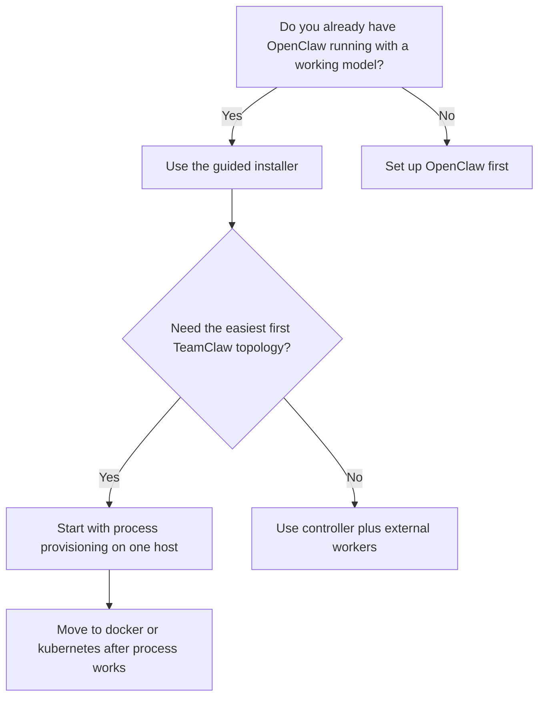

# TeamClaw Installation Guide

This guide is for **first-time TeamClaw users** who want to get to a real working flow quickly.

If you want source layout, repository contributor setup, or implementation details, see:

- [`README.md`](./README.md)
- [`DESIGN.md`](./DESIGN.md)
- Public site: <https://topcheer.github.io/teamclaw/>

## Validation status

TeamClaw is currently **validated end-to-end** on:

- controller + externally registered workers
- `process` provisioning
- `docker` provisioning
- `kubernetes` provisioning

## Desktop app packaging (macOS)

The desktop client lives in `desktop/` and is packaged with Electron Builder.

The desktop app currently ships with generated platform icons in `desktop/build/` (`icon.icns`, `icon.ico`, and `icon.png`). Those desktop icon assets were derived from the website icon so the desktop and public site stay visually aligned.

### Local signed mac build

After your Apple signing certificates are available in Keychain, you can produce a signed app bundle with:

```bash
cd desktop
npm run dist:dir
```

This currently writes the signed app to:

```text
desktop/dist/mac-arm64/TeamClaw Desktop.app
```

### Local notarized mac release build

For distributable mac artifacts (`dmg` and `zip`) with notarization enabled, use App Store Connect API key credentials through environment variables:

```bash
export APPLE_API_KEY=/absolute/path/to/AuthKey_<KEY_ID>.p8
export APPLE_API_KEY_ID=<KEY_ID>
export APPLE_API_ISSUER=<ISSUER_ID>

cd desktop
npm run dist:mac
```

The desktop app uses bundle identifier `gg.ai.teamclaw`. Local release builds currently support macOS (`arm64`, `x64`, `universal`), Linux (`arm64`, `x64`), and Windows (`arm64`, `x64`) packaging from the `desktop/` project.

Notes:

- `APPLE_API_KEY` must point to the downloaded `.p8` file on disk.
- Electron Builder will sign first, then notarize with `notarytool`, then produce the `dmg` and `zip` artifacts.
- If the notarization credentials are missing, Electron Builder skips notarization.

Useful architecture-specific commands:

```bash
cd desktop
npm run dist:mac:arm64
npm run dist:mac:x64
npm run dist:mac:universal
```

### Linux and Windows release builds

The desktop project can also produce Linux and Windows installers locally:

```bash
cd desktop
npm run dist:linux
npm run dist:win
```

Current targets:

- Linux: `AppImage` and `deb`
- Windows: `nsis` installer (`.exe`)

Useful architecture-specific commands:

```bash
cd desktop
npm run dist:linux:arm64
npm run dist:linux:x64
npm run dist:win:arm64
npm run dist:win:x64
```

## Choose the right starting path


```mermaid
flowchart TD
    A[Do you already have OpenClaw running with a working model?] -->|Yes| B[Use the guided installer]
    A -->|No| C[Set up OpenClaw first]
    B --> D{Need the easiest first TeamClaw topology?}
    D -->|Yes| E[Start with process provisioning on one host]
    D -->|No| F[Use controller plus external workers]
    E --> G[Move to docker or kubernetes after process works]
```

## Install options

### Option 1: Guided installer (recommended)

If your local OpenClaw already has at least one working model configuration, the easiest path is:

```bash
npx -y @teamclaws/teamclaw install
```

The guided installer automatically uses OpenClaw's break-glass install flag for TeamClaw, because TeamClaw legitimately needs host orchestration capabilities that the built-in scanner marks as critical.

The guided installer can:

- install or update the TeamClaw plugin
- detect your local `openclaw.json`
- let you choose the install mode
- support non-interactive mode selection with `--install-mode`, including `--install-mode worker` for a dedicated worker-only node
- let you pick from models already defined in OpenClaw
- copy the effective host model into TeamClaw's dedicated agent config when you use independent agent mode
- bootstrap `agents/teamclaw/agent/auth-profiles.json` from the host OpenClaw auth store when it exists
- let you choose the OpenClaw workspace directory
- prefill Docker and Kubernetes defaults with the published TeamClaw runtime image
- prefill Docker workspace persistence with a named volume and Kubernetes persistence with a PVC name
- apply TeamClaw's recommended host execution defaults when those values are missing (`tools.exec.security = "full"`, `tools.exec.ask = "off"`, plus command restart/native defaults)
- preserve stricter existing host security settings and warn in the install summary when they may cause repeated approvals or blocked task execution
- if the host has no usable model or auth configured yet, still finish installation but warn that TeamClaw can start without being able to work until OpenClaw model/auth setup is completed

By default, the installer uses **independent agent mode**. That keeps TeamClaw in its own `teamclaw` agent/workspace instead of sharing the host `main` agent. The legacy shared-`main` layout is still available through `--agent-mode main`, but it is now only for compatibility-sensitive setups.

Useful non-interactive examples:

```bash
# Recommended first host: controller + on-demand local workers
npx -y @teamclaws/teamclaw install --yes --install-mode controller-process

# Dedicated worker node that finds the controller via mDNS on the same LAN
npx -y @teamclaws/teamclaw install --yes --install-mode worker

# Dedicated worker node that connects to a fixed controller URL
npx -y @teamclaws/teamclaw install --yes --install-mode worker --controller-url http://controller.example:9527
```

### Option 2: Install from npm

```bash
openclaw plugins install --dangerously-force-unsafe-install @teamclaws/teamclaw
```

### Option 3: Install from ClawHub

```bash
openclaw plugins install --dangerously-force-unsafe-install clawhub:@teamclaws/teamclaw
```

## Recommended first setup: controller + on-demand `process` workers

For most first-time users, this is the least painful supported path:

1. Run one controller.
2. Let the controller launch workers on demand on the same host.
3. Validate a short smoke-test workflow.
4. Expand to external workers, Docker, or Kubernetes only after the basics are stable.

Why this works well:

- no multi-machine networking to debug
- no worker nodes to bootstrap by hand
- no image distribution or cluster setup yet
- Web UI / desktop visibility, clarifications, workspace browsing, and Git collaboration all work on one host first

### Minimal controller config

Add a TeamClaw plugin entry similar to this in `openclaw.json`:

```json
{
  "plugins": {
    "enabled": true,
    "entries": {
      "teamclaw": {
        "enabled": true,
        "config": {
          "mode": "controller",
          "port": 9527,
          "teamName": "my-team",
          "taskTimeoutMs": 1800000,
          "gitEnabled": true,
          "gitDefaultBranch": "main",
          "gitAuthorName": "TeamClaw",
          "gitAuthorEmail": "teamclaw@local",
          "processModel": "multi",
          "workerProvisioningType": "process",
          "workerProvisioningRoles": [],
          "workerProvisioningMinPerRole": 0,
          "workerProvisioningMaxPerRole": 10,
          "workerProvisioningIdleTtlMs": 120000,
          "workerProvisioningStartupTimeoutMs": 120000
        }
      }
    }
  }
}
```

You also need a working OpenClaw model configuration. A common minimum is:

```json
{
  "agents": {
    "defaults": {
      "model": "my-provider/YOUR_MODEL_ID",
      "timeoutSeconds": 2400,
      "workspace": "/absolute/path/to/teamclaw/workspace"
    }
  }
}
```

If TeamClaw starts but the controller UI or desktop app shows a prominent "cannot work yet" warning, that means the host OpenClaw instance still does not have a usable model and/or auth profile available for TeamClaw's dedicated agent.

If you use the guided installer instead of hand-editing config, note the install modes intentionally write different same-role caps:

- `controller-manual`: lean same-host mode, `workerProvisioningRoles: []`, and startup readiness falls back to a warm `developer` worker
- `controller-process`: same-host process provisioning with user-selected roles and max-per-role
- `worker`: provisioning disabled on that node

### Start OpenClaw

```bash
pnpm openclaw gateway run
```

### Validate that TeamClaw is alive

Health check:

```bash
curl http://127.0.0.1:9527/api/v1/health
```

During provisioning warm-up this endpoint can temporarily return a non-OK readiness state before the first warm worker is online. If `workerProvisioningRoles` is empty, readiness defaults to a warm `developer` worker.

Web UI:

```text
http://127.0.0.1:9527/ui
```

For the first run, you should see:

- workers appear after tasks require them
- the `Planning`, `Tasks`, `Clarifications`, `Workspace`, and `Reports` sections in the controller UI or desktop client
- a healthy controller response from `/api/v1/health`

When a requirement looks medium or complex, you may also see a planning run created before execution begins. That kickoff run captures candidate roles, role-by-role kickoff assessments, and the controller's synthesized execution plan.

### First smoke-test suggestion

Start with a short requirement such as:

```text
Create a minimal static website in the workspace with a README, index.html, and style.css.
```

Confirm the following before you scale up:

- the controller creates tasks
- provisioned workers pick up tasks automatically
- files appear in the workspace
- the UI shows kickoff/planning context when needed, task details during execution, and reports after completion

## Timeout tuning matters

One of the most common first-install mistakes is assuming TeamClaw is broken when the inner OpenClaw agent timed out first.

Watch both timeouts together:

- TeamClaw: `taskTimeoutMs`
- OpenClaw: `agents.defaults.timeoutSeconds`

A safe first setup is:

- `taskTimeoutMs = 1800000` (30 minutes)
- `agents.defaults.timeoutSeconds = 2400` (40 minutes)

Rule of thumb: **OpenClaw's timeout should not be smaller than TeamClaw's timeout**.

Process-provisioned workers now place their runtime directories next to the parent of `agents.defaults.workspace`, inside `teamclaw-runtimes/`, rather than hard-coding `/tmp`.

## External workers

Use this when you want to register separately managed worker nodes instead of letting the controller provision them.

### Controller-side core config

```json
{
  "mode": "controller",
  "port": 9527,
  "teamName": "my-team",
  "taskTimeoutMs": 1800000,
  "gitEnabled": true,
  "gitDefaultBranch": "main"
}
```

### Worker-side core config

```json
{
  "mode": "worker",
  "port": 9528,
  "role": "developer",
  "taskTimeoutMs": 1800000,
  "gitEnabled": true,
  "gitDefaultBranch": "main",
  "controllerUrl": "http://YOUR_CONTROLLER_HOST:9527"
}
```

First-time external-worker advice:

- start with only one `developer` worker
- if the controller and worker are on the same LAN and mDNS is available, you can leave `controllerUrl` empty and let the worker auto-discover the controller
- if the controller is outside the LAN, or mDNS is blocked/unavailable on the worker host, set `controllerUrl` explicitly
- verify worker registration before adding more roles

When you use the guided installer in `worker` mode:

- the installer now probes whether local mDNS discovery appears usable
- if mDNS looks available, it offers **LAN auto-registration** or **manual controller URL**
- if mDNS does not look available, it asks for the controller URL directly
- in non-interactive `--yes` mode, leaving out `--controller-url` preserves runtime mDNS discovery; passing `--controller-url` writes a fixed address
- the controller web UI and desktop app can now generate a copyable one-line worker install command for a selected role, with separate mDNS and manual-LAN-address variants

## On-demand worker provisioning

On-demand provisioning is one of the two supported worker patterns:

- controller-provisioned workers (`process`, `docker`, `kubernetes`)
- separately launched external workers (`mode: "worker"`)

Supported providers:

- `process`
- `docker`
- `kubernetes`

### Recommended first provisioning step: `process`

```json
{
  "mode": "controller",
  "port": 9527,
  "teamName": "my-team",
  "workerProvisioningType": "process",
  "workerProvisioningRoles": [],
  "workerProvisioningMinPerRole": 0,
          "workerProvisioningMaxPerRole": 10,
  "workerProvisioningIdleTtlMs": 120000,
  "workerProvisioningStartupTimeoutMs": 120000
}
```

`workerProvisioningRoles: []` means the controller can decide at runtime which TeamClaw roles to warm or launch by default. Even if you specify a preferred subset, TeamClaw can still launch another role if a pending task explicitly requires it.

If `process` is not healthy yet, `docker` and `kubernetes` will only be harder to debug.

### Before you attempt Docker or Kubernetes, answer these questions

1. How will new workers reach the controller?
2. How will workers receive runtime dependencies and credentials?
3. How will workers gain access to Docker, `kubectl`, or other infrastructure tooling?
4. Is `workerProvisioningControllerUrl` actually reachable from inside the container or pod network?

### Docker example

```json
{
  "mode": "controller",
  "port": 9527,
  "teamName": "my-team",
  "workerProvisioningType": "docker",
  "workerProvisioningControllerUrl": "http://host.docker.internal:9527",
  "workerProvisioningImage": "ghcr.io/topcheer/teamclaw-openclaw:latest",
  "workerProvisioningWorkspaceRoot": "/workspace-root",
  "workerProvisioningDockerWorkspaceVolume": "teamclaw-workspaces",
  "workerProvisioningRoles": ["developer", "qa", "infra-engineer"],
  "workerProvisioningMaxPerRole": 10,
  "workerProvisioningDockerMounts": [
    "/var/run/docker.sock:/var/run/docker.sock"
  ],
  "workerProvisioningPassEnv": ["DOCKER_HOST", "DOCKER_CONFIG", "KUBECONFIG", "NO_PROXY"]
}
```

### Kubernetes example

```json
{
  "mode": "controller",
  "port": 9527,
  "teamName": "my-team",
  "workerProvisioningType": "kubernetes",
  "workerProvisioningControllerUrl": "http://teamclaw-controller.default.svc.cluster.local:9527",
  "workerProvisioningImage": "ghcr.io/topcheer/teamclaw-openclaw:latest",
  "workerProvisioningWorkspaceRoot": "/workspace-root",
  "workerProvisioningKubernetesWorkspacePersistentVolumeClaim": "teamclaw-workspace",
  "workerProvisioningRoles": ["developer", "qa"],
  "workerProvisioningKubernetesNamespace": "default",
  "workerProvisioningKubernetesServiceAccount": "teamclaw-worker",
  "workerProvisioningPassEnv": ["HTTP_PROXY", "HTTPS_PROXY", "NO_PROXY"]
}
```

## Kubernetes and Helm notes

If you want to run the controller in Kubernetes, the repository ships a Helm chart:

- `deploy/helm/teamclaw`

The chart manages:

- controller `Deployment`
- `Service`
- `openclaw.json` `Secret`
- `ServiceAccount` and RBAC
- workspace PVC
- optional `Ingress`

### Important Kubernetes notes

1. The controller runtime must have `kubectl` available if it will provision worker pods. The published TeamClaw runtime image already includes it.
2. The controller `ServiceAccount` must have permission to create and delete pods in the target namespace.
3. `workerProvisioningControllerUrl` must point to a controller address that is reachable from pods, typically a cluster service DNS name.
4. Worker `ServiceAccount`s should keep minimum privileges unless a specific worker task really needs Kubernetes API access.
5. The Helm chart now auto-propagates the controller image, worker image pull secrets, worker service account, and workspace PVC into TeamClaw's Kubernetes worker provisioning config when those fields are left empty.
6. To publish the runtime image to your own registry, use `bash scripts/teamclaw-runtime-image.sh registry.example.com/teamclaw/teamclaw-openclaw:latest` and then install with `deploy/helm/teamclaw/values-private-registry.yaml`.

## FAQ

### The Web UI shows no workers

Check these first:

- `mode` is `controller`
- either `workerProvisioningType` is configured, or remote workers are actually running
- `http://127.0.0.1:9527/api/v1/workers` returns registered workers

### Tasks keep stopping around 10 minutes

This usually means `agents.defaults.timeoutSeconds` is too small.

Increase the OpenClaw timeout first, then retry.

### The architect finished, but the developer never continued

Current TeamClaw code supports **continuing the same intake flow after a controller-created task completes**.

If you still see old behavior, you are probably running an old process or container image and need to restart with current TeamClaw code.

### Docker or Kubernetes workers start but never register

Check these before guessing:

- `workerProvisioningControllerUrl` is really reachable from the worker runtime
- model, proxy, Docker, Kubernetes, and credential dependencies are actually present inside the worker environment

## Recommended upgrade path summary

1. Start with **single-host `process` provisioning**
2. Run a simple smoke-test requirement
3. Tune timeouts correctly
4. Confirm the Web UI, workspace, and clarifications flow all work
5. Then either move to Docker/Kubernetes provisioning or add external workers

That is now the fastest and least ambiguous path to a real TeamClaw installation.
