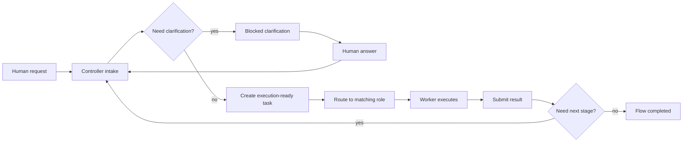

# TeamClaw

TeamClaw is an **OpenClaw plugin** that turns one or more OpenClaw instances into a coordinated virtual software team.

It supports:

- `controller` / `worker` modes
- controller + externally registered workers
- adaptive kickoff planning for medium/complex work, with per-role assessments before execution
- clarification-driven task blocking and resume
- Git-backed workspace collaboration
- on-demand worker provisioning with `process`, `docker`, and `kubernetes`
- a built-in controller UI and desktop client for planning runs, tasks, clarifications, workspace browsing, and delivery reports

**Website:** <https://topcheer.github.io/teamclaw/>

## Current validation status

TeamClaw is currently **validated end-to-end** on the feasible benchmark topologies:

- external workers
- `process` provisioning
- `docker` provisioning
- `kubernetes` provisioning

## Documentation map

- Installation guide: [`INSTALL.md`](./INSTALL.md)
- Design and architecture notes: [`DESIGN.md`](./DESIGN.md)
- Package-facing README: [`src/README.md`](./src/README.md)
- Desktop packaging and release commands: [`INSTALL.md#desktop-app-packaging-macos`](./INSTALL.md#desktop-app-packaging-macos)
- Public marketing site: <https://topcheer.github.io/teamclaw/>

## How TeamClaw flows work


```mermaid
flowchart LR
    U[Human request] --> C[Controller intake]
    C --> Q{Need clarification?}
    Q -- yes --> B[Blocked clarification]
    B --> A[Human answer]
    A --> C
    Q -- no --> T[Create execution-ready task]
    T --> R[Route to matching role]
    R --> W[Worker executes]
    W --> S[Submit result]
    S --> N{Need next stage?}
    N -- yes --> C
    N -- no --> F[Flow completed]
```

The key design constraint is that TeamClaw creates **execution-ready work**, not an entire speculative backlog up front. The controller keeps the flow moving stage by stage, using clarifications when a role is missing required product, technical, or infrastructure decisions.

For requirements that look medium or complex, TeamClaw can also run a **team kickoff meeting** before execution. The controller provisions candidate roles, gathers lightweight kickoff assessments from each role, and then synthesizes those assessments into a clearer task plan, dependency view, and risk summary that is visible in the UI.

## Topology overview

| Topology | What it is | Best first use | Current status |
| --- | --- | --- | --- |
| `external workers` | One controller, multiple separately launched workers | Multi-machine role separation | Validated |
| `process` provisioning | Controller launches same-host worker processes on demand | Best first same-host setup | Validated |
| `docker` provisioning | Controller launches container workers on demand | Isolated worker runtime image | Validated |
| `kubernetes` provisioning | Controller launches worker pods with `kubectl` | Cluster-native deployments | Validated |

## Developer quick start

This section is for repository contributors and source-based local development. If you want the easiest end-user setup, go to [`INSTALL.md`](./INSTALL.md).

### 1. Clone and initialize the submodule

```bash
git clone <repo-url>
cd TeamClaw
git submodule update --init --recursive
```

### 2. Let OpenClaw discover the TeamClaw extension

```bash
bash scripts/symlink-extension.sh
```

This creates:

```text
openclaw/extensions/teamclaw -> ../../src
```

### 3. Install dependencies

```bash
cd openclaw
pnpm install
cd ..
```

### 4. Run OpenClaw

```bash
cd openclaw
pnpm openclaw gateway run
```

## Controller and worker modes

### Controller mode

Controller mode manages the team:

- receives user input
- performs intake and clarification routing
- tracks worker state and task status
- owns the Web UI and WebSocket broadcast channel
- creates execution-ready tasks and continues the flow when prior stages finish

Minimal controller configuration:

```json
{
  "mode": "controller",
  "port": 9527,
  "teamName": "my-team",
  "taskTimeoutMs": 1800000,
  "gitEnabled": true,
  "gitDefaultBranch": "main"
}
```

### On-demand worker provisioning

If you want workers to appear only when needed, set `workerProvisioningType` on the controller. This is now the recommended same-host deployment path:

- `process`: launch same-host worker processes
- `docker`: launch container workers through the Docker API
- `kubernetes`: launch worker pods through `kubectl`

Example `process` provisioning configuration:

```json
{
  "mode": "controller",
  "processModel": "multi",
  "port": 9527,
  "teamName": "my-team",
  "workerProvisioningType": "process",
  "workerProvisioningRoles": [],
  "workerProvisioningMinPerRole": 0,
  "workerProvisioningMaxPerRole": 10,
  "workerProvisioningIdleTtlMs": 120000,
  "workerProvisioningStartupTimeoutMs": 120000
}
```

If you use the guided installer, note that different install modes intentionally write different same-role caps:

- `controller-manual` keeps a lean same-host setup with `workerProvisioningRoles: []`; startup readiness falls back to a warm `developer` worker
- `controller-process` lets you choose `workerProvisioningRoles` and `workerProvisioningMaxPerRole`
- `worker` disables provisioning on that node

Example `docker` provisioning configuration:

```json
{
  "mode": "controller",
  "port": 9527,
  "teamName": "my-team",
  "workerProvisioningType": "docker",
  "workerProvisioningControllerUrl": "http://host.docker.internal:9527",
  "workerProvisioningImage": "ghcr.io/topcheer/teamclaw-openclaw:latest",
  "workerProvisioningWorkspaceRoot": "/workspace-root",
  "workerProvisioningDockerWorkspaceVolume": "teamclaw-workspaces",
  "workerProvisioningRoles": ["developer", "qa", "infra-engineer"],
  "workerProvisioningMaxPerRole": 10,
  "workerProvisioningDockerMounts": [
    "/var/run/docker.sock:/var/run/docker.sock"
  ],
  "workerProvisioningPassEnv": ["DOCKER_HOST", "DOCKER_CONFIG", "KUBECONFIG", "NO_PROXY"]
}
```

### External worker nodes

If you want to run workers on separate machines or long-lived hosts, use `mode: "worker"` and point each worker at the controller:

```json
{
  "mode": "worker",
  "processModel": "multi",
  "port": 9528,
  "role": "developer",
  "teamName": "my-team",
  "controllerUrl": "http://YOUR_CONTROLLER_HOST:9527",
  "taskTimeoutMs": 1800000,
  "gitEnabled": true,
  "gitDefaultBranch": "main"
}
```

## Clarifications are a first-class part of the flow

When a role cannot safely continue because a requirement, decision, credential, or infrastructure dependency is missing, it should raise a clarification instead of guessing.

The task then becomes `blocked`, appears in the Web UI clarifications view, and resumes after a human answer is posted.

This is especially important for infra and DevOps work: TeamClaw should not pretend required infrastructure already exists.

## Git-backed workspace collaboration

TeamClaw uses **git** as the default collaboration layer.

- The controller initializes a repository inside the shared workspace.
- In distributed mode, workers can sync from controller-hosted **git bundle** endpoints even when you do not have an external Git service.
- If `gitRemoteUrl` is configured and the controller can push to it, distributed workers switch to standard `clone / pull / push` behavior.

Recommended git settings:

```json
{
  "gitEnabled": true,
  "gitDefaultBranch": "main",
  "gitRemoteUrl": "",
  "gitAuthorName": "TeamClaw",
  "gitAuthorEmail": "teamclaw@local"
}
```

Default collaboration behavior:

1. The controller prepares the workspace repository before work begins.
2. Workers sync the repo before task execution.
3. Distributed workers publish changes after task completion.
4. If a remote repository is unavailable, TeamClaw falls back to bundle-based sync instead of losing collaboration entirely.

## Supported roles

| Role | Description |
| --- | --- |
| `pm` | Product manager |
| `architect` | Software architect |
| `developer` | Developer |
| `qa` | Quality assurance engineer |
| `release-engineer` | Release engineer |
| `infra-engineer` | Infrastructure engineer |
| `devops` | DevOps engineer |
| `security-engineer` | Security engineer |
| `designer` | Product / UI designer |
| `marketing` | Marketing specialist |

## Testing

### Fast regression anchors

These are the quickest smoke checks for repository changes:

```bash
node tests/test-worker-contracts.mjs
node tests/test-controller-intake.mjs
```

### Docker integration tests

```bash
bash tests/run-tests.sh
bash tests/run-tests.sh --skip-build
bash tests/run-tests.sh --keep
```

`tests/test-api.sh` also covers the clarification loop (`blocked -> answered -> resumed`) and verifies the clarifications tab in the Web UI.

If you want the integration container to provision additional external dependencies from inside the test environment, you can enable host provisioning mode:

```bash
TEAMCLAW_TEST_HOST_PROVISIONING=1 \
TEAMCLAW_TEST_DOCKER_SOCK=/var/run/docker.sock \
TEAMCLAW_TEST_KUBECONFIG=$HOME/.kube/config \
 bash tests/run-tests.sh --skip-build
```

## Release

TeamClaw release is split intentionally:

- **npm** uses GitHub Actions trusted publishing via `.github/workflows/teamclaw-plugin-npm-release.yml`
- **ClawHub package + skills** use the local CLI

Maintainer checklist:

```bash
npm --prefix src run manifest:sync
npm --prefix src run release:check
npm --prefix src run release:clawhub:dry-run
```

Before the real ClawHub push, bump `version:` in each changed `src/skills/*/SKILL.md`.

The npm package is published by GitHub Actions when a `v*` tag is pushed (or via manual workflow dispatch). That workflow expects GitHub's `npm-release` environment and npm trusted publishing to already be configured.

When the preview looks right:

```bash
git tag v$(node -p "require('./src/package.json').version")
git push origin main --tags

clawhub login
bash scripts/teamclaw-clawhub-release.sh --publish
```

## Repository layout

```text
TeamClaw/
|-- openclaw/          # upstream OpenClaw submodule
|-- src/               # TeamClaw plugin source
|-- tests/             # integration and smoke tests
|-- scripts/           # repository utilities
|-- docs/              # GitHub Pages site
`-- screenshots/       # real product screenshots
```
